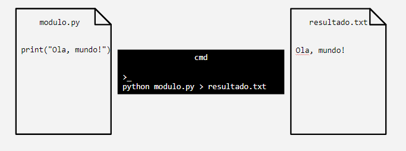
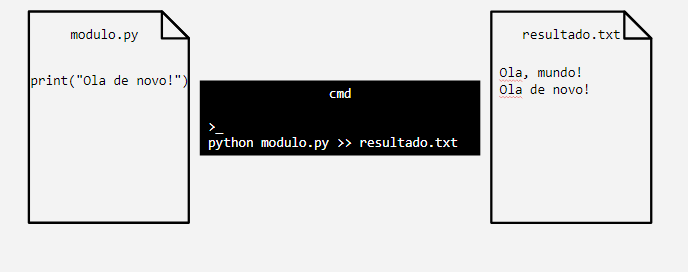
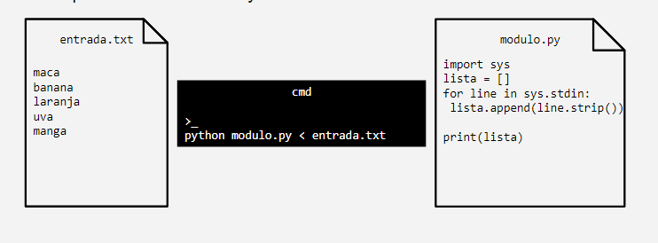

## Prompt de comandos
* Interface de texto onde se pode digitar comandos para interagir diretamente com o sistema operacional do computador
* No Windows:
* * CMD: interface de linha de comando mais simples, que recebe comandos mais básicos do sistema operacional
* * PowerShell: plataforma muito mais poderosa, com uma linguagem de script completa. Permite a execução de comandos mais complexos, bem como a manipulação de objetos
* Comandos executados no prompt geram resultados (dados)
* Comandos no prompt podem necessitar de dados para que sejam executados 
* É possível armazenar os resultados da execução de comandos em arquivos, bem fornecer dados para comandos a partir de arquivos ou outros comandos
* Gerenciamento de Arquivos e Pastas: registrar a lista de arquivos para auditoria ou inventário
* Monitoramento de Sistema: registrar o uso de recursos do sistema (CPU, memória) para diagnóstico ou análise de performance
* Relatórios de Diagnóstico: registrar eventos de erro ou falhas de aplicação em logs
* Análise de Dados: filtrar e registrar informações específicas de arquivos de log, como mensagens de erro ou alertas.

## Redirecionamento de saída para arquivos
* Permite salvar, em um arquivo, a saída (resultado) da execução de um comando
* Operadores para redirecionamento de saída para arquivos:
* * >: Sobrescreve o arquivo com a nova saída. Se o arquivo já existir, ele será substituído com a nova informação gerada pelo comando.
* * >>: Adiciona a saída ao final do arquivo existente. Útil quando se deseja acumular informações sem apagar o conteúdo anterior

* Exemplo: salvando o resultado da execução de um módulo de Python em arquivo de texto:



* Exemplo: salvando o resultado da execução de um módulo de Python em arquivo de texto:



* Outros exemplos
* * Listando bibliotecas instaladas para configuração de ambiente de desenvolvimento:

```pip freeze > requirements.txt ```

* Identificando a versão do Python para configuração

```python –V > documentacao.txt```

* Adicionando configurações da máquina (No PowerShell):

```Get-ComputerInfo >> documentacao.txt ```

## Redirecionamento de entrada para comandos

* Permite fornecer dados para a execução de um comando a partir de um arquivo.
* Operadores para redirecionamento de entrada a partir de arquivos:

* * <: Utiliza o conteúdo de um arquivo como entrada para o comando. 
* * | (pipe): Passa a saída de um comando diretamente como entrada para outro comando. Mais comumente usado para encadear comandos

* Exemplo: fornecendo os dados de um arquivo de texto para um módulo de Python



* Outros exemplos:
* * Salvando a lista do exemplo anterior, em ordem alfabética, em um arquivo de texto:

``` python modulo.py < entrada.txt > log.txt ```
* * Verificando se a biblioteca pandas está entre as bibliotecas necessárias para um projeto (No PowerShell):

* * Verificando se a biblioteca pandas está entre as bibliotecas necessárias para um projeto (No PowerShell):

``` Get-Content requirements.txt | Select-String “pandas" ``` 