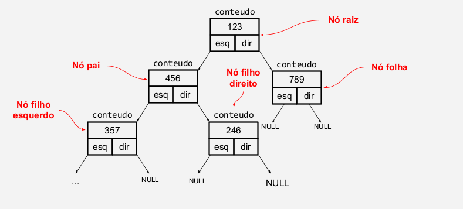
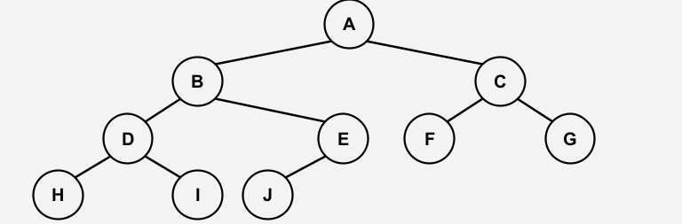
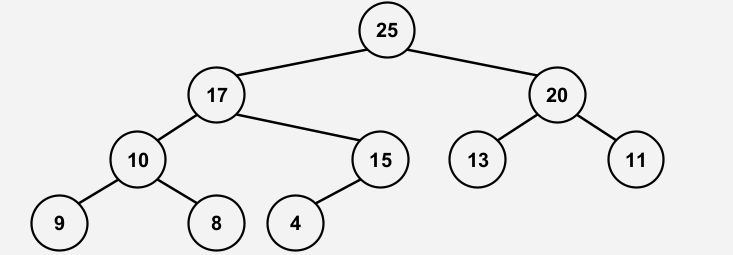
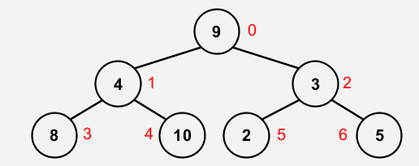

### Aula 20: técnicas de programação IMPACTA
17 de Outubro de 2024
#### Anotações e comentários feitos por Gabriel Muchon Pavanelli (github: gblsunn)
Ordenação simples: Heap Sort

#### Árvore binária:

* Uma árvore binária (heap) é um conjunto de
registros que satisfazem certas condições
(veremos);

* Os registros serão chamados nós. Cada nó tem o
seu respectivo endereço;

* Cada nó tem apenas três campos: um número
inteiro e dois ponteiros para outros nós;

* O campo conteudo é a carga útil do nó;

* Os dois outros campos servem apenas para dar
estrutura à árvore. Os campos esq e dir de cada
nó contém NULL ou o endereço de outro nó.

#### Árvore binária completa

* Árvore Binária Completa: Todos os níveis estão
totalmente preenchidos, possivelmente com
exceção do último, que deve ser preenchido da
esquerda para a direita.

#### Árvore binária máxima (heap máximo)
* Árvore Binária Máxima (heap máximo): árvore
binária completa cujo valor de cada nó pai é maior
ou igual ao valor de seus nós filhos.

#### Árvore binária x vetores
* Podemos enxergar um vetor como uma árvore
binária completa.
##### V= [9,4,3,8,10,2,5]

##### V= [9,4,3,8,10,2,5]
##### **Nós internos **V= [**9,4,3,**8,10,2,5]
##### **Nós Externos** V= [**9,4,3,**8,10,2,5]
