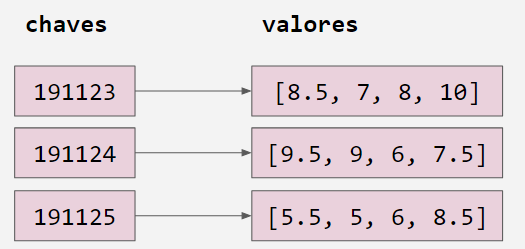

# NOVAS ESTRUTURAS DE DADOS
## Conjuntos e Dicionários
* Tipo de dado set: coleção não ordenada  de elementos distintos
* Variáveis do tipo set suportam operações como len, for, in, etc.
* Por serem coleções não ordenadas, não registram a posição dos elementos ou a ordem de inserção. Não suportam operações como indexação e fatiamento.
* Sintaxe:
``` 
nome = {
   elemento1,
   elemento2,
   elemento3
} 
```
* Exemplo: turmas e alunos


```
poo = {
   estudante1,
   estudante2,
   estudante3
}

poo = {
   estudante1,
   estudante2,
   estudante4
}
 ```
## Dicionário

* Dicionário é uma estrutura de dados que associa uma chave com um valor
* A chave funciona como índice para acessar o valor
* As chaves devem ser únicas

## Dicionários em Python

* Tipo de dados: dict
* Sintaxe

```
nome = {
    chave1: valor1,
    chave2: valor2,
    chave3: valor3,
}
```

* Exemplo:

Estudantes = {
    191123: [8.5, 7, 8, 10]
    191124: [9.5, 9, 6, 8.5]
    191125: [5.5, 5, 6, 8.5]
}

